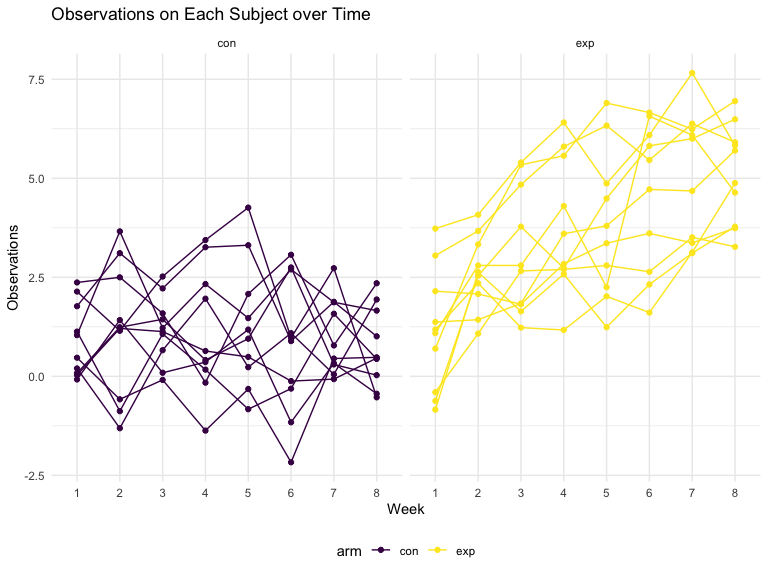

p8105_hw5_jw4348
================
Jingyu Wang
2023-11-15

## Problem 1

For this problem, we are interested in data gathered and made public by
*The Washington Post* on homicides in 50 large U.S. cities. The code
chunk below imports and cleans the data.

``` r
homicide_df = 
  read_csv("data/homicide-data.csv", na = c("", "NA", "Unknown")) %>%
  mutate(
    city_state = str_c(city, state, sep = ", "),
    resolution = case_when(
      disposition == "Closed without arrest" ~ "unsolved",
      disposition == "Open/No arrest"        ~ "unsolved",
      disposition == "Closed by arrest"      ~ "solved"
    )
  ) %>% 
  filter(city_state != "Tulsa, AL") 
```

    ## Rows: 52179 Columns: 12
    ## ── Column specification ────────────────────────────────────────────────────────
    ## Delimiter: ","
    ## chr (8): uid, victim_last, victim_first, victim_race, victim_sex, city, stat...
    ## dbl (4): reported_date, victim_age, lat, lon
    ## 
    ## ℹ Use `spec()` to retrieve the full column specification for this data.
    ## ℹ Specify the column types or set `show_col_types = FALSE` to quiet this message.

The resulting dataframe has 52178 entries, on variables that include the
victim name, race, age, and sex; the date the homicide was reported; and
the location of the homicide. In cleaning, I created a `city_state`
variable that includes both city and state, and a `resolution` variable
to indicate whether the case was closed by arrest. I also excluded one
entry in Tulsa, AL, which is not a major US city and is most likely a
data entry error.

In the next code chunk, I group within cities and summarize to produce
the total number of homicides and the number that are solved.

``` r
city_homicide_df = 
  homicide_df %>% 
  select(city_state, disposition, resolution) %>% 
  group_by(city_state) %>% 
  summarize(
    hom_total = n(),
    hom_unsolved = sum(resolution == "unsolved"))
```

Focusing only on Baltimore, MD, I can use the `prop.test` and
`broom::tidy` functions to obtain an estimate and CI of the proportion
of unsolved homicides in that city. The table below shows those values.

``` r
bmore_test = 
  prop.test(
    x = filter(city_homicide_df, city_state == "Baltimore, MD") %>% pull(hom_unsolved),
    n = filter(city_homicide_df, city_state == "Baltimore, MD") %>% pull(hom_total)) 

broom::tidy(bmore_test) %>% 
  knitr::kable(digits = 3)
```

| estimate | statistic | p.value | parameter | conf.low | conf.high | method                                               | alternative |
|---------:|----------:|--------:|----------:|---------:|----------:|:-----------------------------------------------------|:------------|
|    0.646 |   239.011 |       0 |         1 |    0.628 |     0.663 | 1-sample proportions test with continuity correction | two.sided   |

Building on this code, I can use functions in the `purrr` package to
obtain estimates and CIs for the proportion of unsolved homicides in
each city in my dataset. The code below implements this analysis.

``` r
test_results = 
  city_homicide_df %>% 
  mutate(
    prop_tests = map2(hom_unsolved, hom_total, \(x, y) prop.test(x = x, n = y)),
    tidy_tests = map(prop_tests, broom::tidy)) %>% 
  select(-prop_tests) %>% 
  unnest(tidy_tests) %>% 
  select(city_state, estimate, conf.low, conf.high) %>% 
  mutate(city_state = fct_reorder(city_state, estimate))
```

Finally, I make a plot showing the estimate (and CI) of the proportion
of unsolved homicides in each city.

``` r
test_results %>% 
  mutate(city_state = fct_reorder(city_state, estimate)) %>% 
  ggplot(aes(x = city_state, y = estimate)) + 
  geom_point() + 
  geom_errorbar(aes(ymin = conf.low, ymax = conf.high)) + 
  theme(axis.text.x = element_text(angle = 90, hjust = 1))
```


This figure suggests a very wide range in the rate at which homicides
are solved – Chicago is noticeably high and, given the narrowness of the
CI, likely is the location of many homicides.

## Problem 2

I will create a tidy dataframe containing data from all participants,
including the subject ID, arm, and observations over time.

#### Start with a dataframe containing all file name.Iterate over file names and read in data for each subject and saving the result as a new variable in the dataframe

``` r
df_study = 
  tibble(
    file = list.files("data/problem_1/"),
    path = str_c("data/problem_1/", file)
        ) |> 
    mutate(data = map(path, read_csv)) |>
    unnest()
```

    ## Rows: 1 Columns: 8
    ## ── Column specification ────────────────────────────────────────────────────────
    ## Delimiter: ","
    ## dbl (8): week_1, week_2, week_3, week_4, week_5, week_6, week_7, week_8
    ## 
    ## ℹ Use `spec()` to retrieve the full column specification for this data.
    ## ℹ Specify the column types or set `show_col_types = FALSE` to quiet this message.
    ## Rows: 1 Columns: 8
    ## ── Column specification ────────────────────────────────────────────────────────
    ## Delimiter: ","
    ## dbl (8): week_1, week_2, week_3, week_4, week_5, week_6, week_7, week_8
    ## 
    ## ℹ Use `spec()` to retrieve the full column specification for this data.
    ## ℹ Specify the column types or set `show_col_types = FALSE` to quiet this message.
    ## Rows: 1 Columns: 8
    ## ── Column specification ────────────────────────────────────────────────────────
    ## Delimiter: ","
    ## dbl (8): week_1, week_2, week_3, week_4, week_5, week_6, week_7, week_8
    ## 
    ## ℹ Use `spec()` to retrieve the full column specification for this data.
    ## ℹ Specify the column types or set `show_col_types = FALSE` to quiet this message.
    ## Rows: 1 Columns: 8
    ## ── Column specification ────────────────────────────────────────────────────────
    ## Delimiter: ","
    ## dbl (8): week_1, week_2, week_3, week_4, week_5, week_6, week_7, week_8
    ## 
    ## ℹ Use `spec()` to retrieve the full column specification for this data.
    ## ℹ Specify the column types or set `show_col_types = FALSE` to quiet this message.
    ## Rows: 1 Columns: 8
    ## ── Column specification ────────────────────────────────────────────────────────
    ## Delimiter: ","
    ## dbl (8): week_1, week_2, week_3, week_4, week_5, week_6, week_7, week_8
    ## 
    ## ℹ Use `spec()` to retrieve the full column specification for this data.
    ## ℹ Specify the column types or set `show_col_types = FALSE` to quiet this message.
    ## Rows: 1 Columns: 8
    ## ── Column specification ────────────────────────────────────────────────────────
    ## Delimiter: ","
    ## dbl (8): week_1, week_2, week_3, week_4, week_5, week_6, week_7, week_8
    ## 
    ## ℹ Use `spec()` to retrieve the full column specification for this data.
    ## ℹ Specify the column types or set `show_col_types = FALSE` to quiet this message.
    ## Rows: 1 Columns: 8
    ## ── Column specification ────────────────────────────────────────────────────────
    ## Delimiter: ","
    ## dbl (8): week_1, week_2, week_3, week_4, week_5, week_6, week_7, week_8
    ## 
    ## ℹ Use `spec()` to retrieve the full column specification for this data.
    ## ℹ Specify the column types or set `show_col_types = FALSE` to quiet this message.
    ## Rows: 1 Columns: 8
    ## ── Column specification ────────────────────────────────────────────────────────
    ## Delimiter: ","
    ## dbl (8): week_1, week_2, week_3, week_4, week_5, week_6, week_7, week_8
    ## 
    ## ℹ Use `spec()` to retrieve the full column specification for this data.
    ## ℹ Specify the column types or set `show_col_types = FALSE` to quiet this message.
    ## Rows: 1 Columns: 8
    ## ── Column specification ────────────────────────────────────────────────────────
    ## Delimiter: ","
    ## dbl (8): week_1, week_2, week_3, week_4, week_5, week_6, week_7, week_8
    ## 
    ## ℹ Use `spec()` to retrieve the full column specification for this data.
    ## ℹ Specify the column types or set `show_col_types = FALSE` to quiet this message.
    ## Rows: 1 Columns: 8
    ## ── Column specification ────────────────────────────────────────────────────────
    ## Delimiter: ","
    ## dbl (8): week_1, week_2, week_3, week_4, week_5, week_6, week_7, week_8
    ## 
    ## ℹ Use `spec()` to retrieve the full column specification for this data.
    ## ℹ Specify the column types or set `show_col_types = FALSE` to quiet this message.
    ## Rows: 1 Columns: 8
    ## ── Column specification ────────────────────────────────────────────────────────
    ## Delimiter: ","
    ## dbl (8): week_1, week_2, week_3, week_4, week_5, week_6, week_7, week_8
    ## 
    ## ℹ Use `spec()` to retrieve the full column specification for this data.
    ## ℹ Specify the column types or set `show_col_types = FALSE` to quiet this message.
    ## Rows: 1 Columns: 8
    ## ── Column specification ────────────────────────────────────────────────────────
    ## Delimiter: ","
    ## dbl (8): week_1, week_2, week_3, week_4, week_5, week_6, week_7, week_8
    ## 
    ## ℹ Use `spec()` to retrieve the full column specification for this data.
    ## ℹ Specify the column types or set `show_col_types = FALSE` to quiet this message.
    ## Rows: 1 Columns: 8
    ## ── Column specification ────────────────────────────────────────────────────────
    ## Delimiter: ","
    ## dbl (8): week_1, week_2, week_3, week_4, week_5, week_6, week_7, week_8
    ## 
    ## ℹ Use `spec()` to retrieve the full column specification for this data.
    ## ℹ Specify the column types or set `show_col_types = FALSE` to quiet this message.
    ## Rows: 1 Columns: 8
    ## ── Column specification ────────────────────────────────────────────────────────
    ## Delimiter: ","
    ## dbl (8): week_1, week_2, week_3, week_4, week_5, week_6, week_7, week_8
    ## 
    ## ℹ Use `spec()` to retrieve the full column specification for this data.
    ## ℹ Specify the column types or set `show_col_types = FALSE` to quiet this message.
    ## Rows: 1 Columns: 8
    ## ── Column specification ────────────────────────────────────────────────────────
    ## Delimiter: ","
    ## dbl (8): week_1, week_2, week_3, week_4, week_5, week_6, week_7, week_8
    ## 
    ## ℹ Use `spec()` to retrieve the full column specification for this data.
    ## ℹ Specify the column types or set `show_col_types = FALSE` to quiet this message.
    ## Rows: 1 Columns: 8
    ## ── Column specification ────────────────────────────────────────────────────────
    ## Delimiter: ","
    ## dbl (8): week_1, week_2, week_3, week_4, week_5, week_6, week_7, week_8
    ## 
    ## ℹ Use `spec()` to retrieve the full column specification for this data.
    ## ℹ Specify the column types or set `show_col_types = FALSE` to quiet this message.
    ## Rows: 1 Columns: 8
    ## ── Column specification ────────────────────────────────────────────────────────
    ## Delimiter: ","
    ## dbl (8): week_1, week_2, week_3, week_4, week_5, week_6, week_7, week_8
    ## 
    ## ℹ Use `spec()` to retrieve the full column specification for this data.
    ## ℹ Specify the column types or set `show_col_types = FALSE` to quiet this message.
    ## Rows: 1 Columns: 8
    ## ── Column specification ────────────────────────────────────────────────────────
    ## Delimiter: ","
    ## dbl (8): week_1, week_2, week_3, week_4, week_5, week_6, week_7, week_8
    ## 
    ## ℹ Use `spec()` to retrieve the full column specification for this data.
    ## ℹ Specify the column types or set `show_col_types = FALSE` to quiet this message.
    ## Rows: 1 Columns: 8
    ## ── Column specification ────────────────────────────────────────────────────────
    ## Delimiter: ","
    ## dbl (8): week_1, week_2, week_3, week_4, week_5, week_6, week_7, week_8
    ## 
    ## ℹ Use `spec()` to retrieve the full column specification for this data.
    ## ℹ Specify the column types or set `show_col_types = FALSE` to quiet this message.
    ## Rows: 1 Columns: 8
    ## ── Column specification ────────────────────────────────────────────────────────
    ## Delimiter: ","
    ## dbl (8): week_1, week_2, week_3, week_4, week_5, week_6, week_7, week_8
    ## 
    ## ℹ Use `spec()` to retrieve the full column specification for this data.
    ## ℹ Specify the column types or set `show_col_types = FALSE` to quiet this message.

``` r
df_study
```

    ## # A tibble: 20 × 10
    ##    file       path       week_1 week_2 week_3 week_4 week_5 week_6 week_7 week_8
    ##    <chr>      <chr>       <dbl>  <dbl>  <dbl>  <dbl>  <dbl>  <dbl>  <dbl>  <dbl>
    ##  1 con_01.csv data/prob…   0.2   -1.31   0.66   1.96   0.23   1.09   0.05   1.94
    ##  2 con_02.csv data/prob…   1.13  -0.88   1.07   0.17  -0.83  -0.31   1.58   0.44
    ##  3 con_03.csv data/prob…   1.77   3.11   2.22   3.26   3.31   0.89   1.88   1.01
    ##  4 con_04.csv data/prob…   1.04   3.66   1.22   2.33   1.47   2.7    1.87   1.66
    ##  5 con_05.csv data/prob…   0.47  -0.58  -0.09  -1.37  -0.32  -2.17   0.45   0.48
    ##  6 con_06.csv data/prob…   2.37   2.5    1.59  -0.16   2.08   3.07   0.78   2.35
    ##  7 con_07.csv data/prob…   0.03   1.21   1.13   0.64   0.49  -0.12  -0.07   0.46
    ##  8 con_08.csv data/prob…  -0.08   1.42   0.09   0.36   1.18  -1.16   0.33  -0.44
    ##  9 con_09.csv data/prob…   0.08   1.24   1.44   0.41   0.95   2.75   0.3    0.03
    ## 10 con_10.csv data/prob…   2.14   1.15   2.52   3.44   4.26   0.97   2.73  -0.53
    ## 11 exp_01.csv data/prob…   3.05   3.67   4.84   5.8    6.33   5.46   6.38   5.91
    ## 12 exp_02.csv data/prob…  -0.84   2.63   1.64   2.58   1.24   2.32   3.11   3.78
    ## 13 exp_03.csv data/prob…   2.15   2.08   1.82   2.84   3.36   3.61   3.37   3.74
    ## 14 exp_04.csv data/prob…  -0.62   2.54   3.78   2.73   4.49   5.82   6      6.49
    ## 15 exp_05.csv data/prob…   0.7    3.33   5.34   5.57   6.9    6.66   6.24   6.95
    ## 16 exp_06.csv data/prob…   3.73   4.08   5.4    6.41   4.87   6.09   7.66   5.83
    ## 17 exp_07.csv data/prob…   1.18   2.35   1.23   1.17   2.02   1.61   3.13   4.88
    ## 18 exp_08.csv data/prob…   1.37   1.43   1.84   3.6    3.8    4.72   4.68   5.7 
    ## 19 exp_09.csv data/prob…  -0.4    1.08   2.66   2.7    2.8    2.64   3.51   3.27
    ## 20 exp_10.csv data/prob…   1.09   2.8    2.8    4.3    2.25   6.57   6.09   4.64

#### And then I tidy the result; manipulate file names to include control arm and subject ID, make sure weekly observations are “tidy”, and do any other tidying that’s necessary

``` r
tidy_df = 
  df_study |> 
  mutate(
    file = str_remove(file, ".csv"),
        ) |>
  separate(file, into = c("arm", "subject_id"), sep = "_") |>
  pivot_longer(
    cols = week_1:week_8,
    names_to = "week",
    names_prefix = "week_",
    values_to = "observations"
              ) |>
  select(subject_id, arm, week, observations)
tidy_df
```

    ## # A tibble: 160 × 4
    ##    subject_id arm   week  observations
    ##    <chr>      <chr> <chr>        <dbl>
    ##  1 01         con   1             0.2 
    ##  2 01         con   2            -1.31
    ##  3 01         con   3             0.66
    ##  4 01         con   4             1.96
    ##  5 01         con   5             0.23
    ##  6 01         con   6             1.09
    ##  7 01         con   7             0.05
    ##  8 01         con   8             1.94
    ##  9 02         con   1             1.13
    ## 10 02         con   2            -0.88
    ## # ℹ 150 more rows

#### Next I will make a spaghetti plot showing observations on each subject over time

``` r
tidy_df |> 
  ggplot(aes(x = week, y = observations, group = subject_id, color = arm)) +
  geom_point() +
  geom_path() +
  facet_grid( ~ arm) +
  labs(title = "Observations on Each Subject over Time",
       x = "Week",
       y = "Observations") 
```



#### Finally, I will comment on differences between groups.

- In the control arm:
  - The observations fluctuate without a clear overall trend. There is
    no consistent upward or downward pattern in observations from week 1
    to 8.
- In the experiment arm:
  - The overall trend in observations is upward over time.
  - Unlike the control group, there is a noticeable increase in
    observations from week 1 to 8.
- Therefore, the difference trends between groups suggests a potential
  difference in the response to treatment between the control and
  experiment groups, with the experiment group showing a more systematic
  increase in observations over time.

## Problem 3

#### First I will set the design elements

``` r
sim_test = function(n = 30, mu, sigma = 5) {
  
  x_vec = tibble(
    x = rnorm(n = n, mean = mu, sd = sigma),
  )
  
t_test_result = x_vec |>
    summarize(
      mu_hat = t.test(x_vec,conf.level = 0.95) |>
        broom::tidy() |>
        pull(estimate),
      p_value = t.test(x_vec,conf.level = 0.95) |>
        broom::tidy() |>
        pull(p.value)
    )
}
```

#### Then I will iterate by setting μ=0 and generate 5000 datasets from the model

``` r
output = vector("list", length = 5000)

for (i in 1:5000) {
  
  output[[i]] = sim_test(mu=0)
  
}

sim_results = bind_rows(output)

sim_results
```

    ## # A tibble: 5,000 × 2
    ##     mu_hat p_value
    ##      <dbl>   <dbl>
    ##  1 -1.44     0.115
    ##  2 -0.532    0.437
    ##  3 -0.959    0.198
    ##  4 -0.950    0.280
    ##  5  0.907    0.389
    ##  6  0.733    0.514
    ##  7 -1.00     0.299
    ##  8 -1.04     0.246
    ##  9 -0.0416   0.969
    ## 10  0.646    0.512
    ## # ℹ 4,990 more rows

#### Then I will repeat the above for μ={1,2,3,4,5,6}

``` r
output = vector("list", length = 5000)

for (i in 1:5000) {
  
  output[[i]] = sim_test(mu=0)
  
}

bind_rows(output)
```

    ## # A tibble: 5,000 × 2
    ##     mu_hat p_value
    ##      <dbl>   <dbl>
    ##  1  1.75    0.0429
    ##  2 -0.554   0.623 
    ##  3 -0.803   0.453 
    ##  4 -0.735   0.401 
    ##  5 -0.0492  0.955 
    ##  6  0.939   0.324 
    ##  7 -0.250   0.805 
    ##  8 -1.00    0.291 
    ##  9  1.28    0.249 
    ## 10  0.921   0.358 
    ## # ℹ 4,990 more rows

``` r
sim_result = tibble(
  mu = c(1,2,3,4,5,6)
) |> 
  mutate(
    output_lists = map(mu, ~rerun(5000,sim_test(30,.x,5))),
    estimate_df = map(output_lists, bind_rows)
        ) |>
  select(-output_lists) |> 
  unnest(estimate_df)
```

#### Then I will make a plot showing the proportion of times the null was rejected.

``` r
plot_power = sim_result |> 
  mutate(
    decision = case_when(
      p_value < 0.05 ~ "reject",
      p_value >= 0.05 ~ "fail to reject"
                        )
        ) |> 
  group_by(mu) |> 
  summarise(
    all_decision = n(),
    reject = sum(decision == "reject")
  ) |> 
  mutate(
    power = reject/all_decision
         ) |> 
  ggplot(aes(x = mu, y = power, color = mu)) +
  geom_point() +
  geom_line() +
  labs(
    x = "True means",
    y = "Power",
    title = "Plot: Power of Test")

plot_power
```


- We can see from the graph, the power increases as effect size
  increases. The association between effect size and power is positive.
- Larger effect sizes make differences between groups more noticeable,
  leading to a greater likelihood of detecting a significant effect.

#### Then I will make another plot showing the average estimate of μ̂ on the y axis and the true value of μ on the x axis.

``` r
sim_result |> 
  mutate(
    decision = case_when(
      p_value < 0.05 ~ "reject",
      p_value >= 0.05 ~ "fail to reject"
                        )
        ) |>
  group_by(mu) |> 
  summarise(
    average_mu_hat = mean(mu_hat)
  ) |> 
  ggplot(aes(x = mu , y = average_mu_hat, color = mu )) +
  geom_point() +
  geom_line() +
  labs(
     x = "True Means",
     y = "Average Mean Estimate",
     title = "Average Estimtaed Mean vs. True means"
  ) 
```


``` r
sim_result
```

    ## # A tibble: 30,000 × 3
    ##       mu   mu_hat p_value
    ##    <dbl>    <dbl>   <dbl>
    ##  1     1  0.121    0.907 
    ##  2     1  1.03     0.308 
    ##  3     1  0.975    0.423 
    ##  4     1 -0.00590  0.994 
    ##  5     1  0.955    0.205 
    ##  6     1  0.873    0.382 
    ##  7     1  1.74     0.0829
    ##  8     1  0.847    0.333 
    ##  9     1  0.724    0.437 
    ## 10     1 -0.817    0.319 
    ## # ℹ 29,990 more rows

#### Then I will make a second plot the average estimate of μ̂ only in samples for which the null was rejected on the y axis and the true value of μ on the x axis.

``` r
sim_result |> 
  mutate(
    decision = case_when(
      p_value < 0.05 ~ "reject",
      p_value >= 0.05 ~ "fail to reject"
                        )
        ) |>
  group_by(mu) |> 
  filter(decision == "reject") |>
  summarise(
    average_mu_hat = mean(mu_hat)
  ) |> 
  ggplot(aes(x = mu , y = average_mu_hat, color = mu )) +
  geom_point() +
  geom_line() +
    labs(
     x = "True Means",
     y = "Average Mean Estimate of Reject the Null",
     title = "Average Estimtaed Mean of rejection vs. True means"
  ) 
```


``` r
sim_result
```

    ## # A tibble: 30,000 × 3
    ##       mu   mu_hat p_value
    ##    <dbl>    <dbl>   <dbl>
    ##  1     1  0.121    0.907 
    ##  2     1  1.03     0.308 
    ##  3     1  0.975    0.423 
    ##  4     1 -0.00590  0.994 
    ##  5     1  0.955    0.205 
    ##  6     1  0.873    0.382 
    ##  7     1  1.74     0.0829
    ##  8     1  0.847    0.333 
    ##  9     1  0.724    0.437 
    ## 10     1 -0.817    0.319 
    ## # ℹ 29,990 more rows

- At the beginning of the graph, around the effect size before 4, the
  sample average of μ̂ across tests for which the null is rejected does
  not approximatly equal to the true value of μ.
- However, when effect size is equal and greater than 4, the sample
  average of μ̂ across tests for which the null is rejected approximately
  equal to the true value of μ.
- The reason can be the power of a statistical test to detect a true
  effect is influenced by both the effect size and sample size. A
  smaller effect size makes it challenging to detect a significant
  difference, especially with a fixed small sample size, as the signal
  from the difference is weaker. Larger effect sizes, on the other hand,
  provide a more noticeable and substantial difference, enhancing the
  test’s ability to identify significant departures from the null
  hypothesis. As the effect size increases, so does the statistical
  power, reflecting the test’s increased likelihood of correctly
  rejecting a false null hypothesis when a true effect is present.
